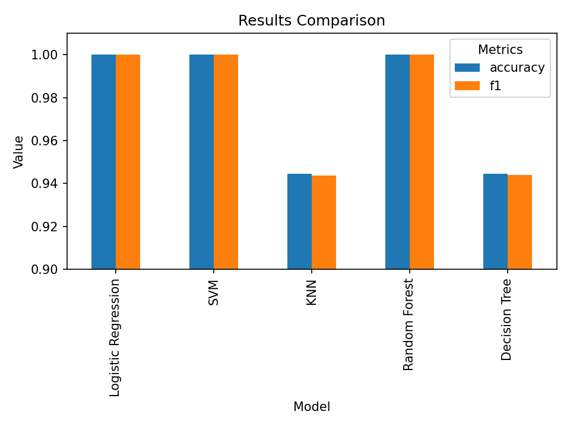
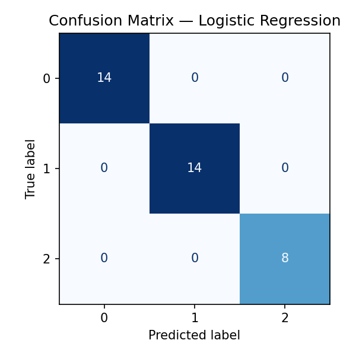

# 🍷 Wine Classifier — A Reproducible Machine Learning Project

<!-- 🔹 badges section -->
[](https://github.com/Jay6877-git/wine-classifier/actions/workflows/ci.yml)

[](LICENSE)
[](https://github.com/psf/black)

[](https://github.com/pre-commit/pre-commit)


## 🧭 Overview

**Wine Classifier** is a fully reproducible machine-learning project designed to mirror a **real-world MLOps workflow** — not just training a model, but structuring it cleanly, testing it automatically, and ensuring long-term maintainability.

It demonstrates how to:

- 🧩 **Organize modular ML code** for clarity and scalability  
- 🧪 **Automate testing** to guarantee reliability  
- ⚙️ **Persist models and metrics** for reproducibility  
- 📊 **Evaluate and visualize results** consistently  
- 🚀 **Integrate CI/CD** using *pre-commit*, *black*, *ruff*, and *GitHub Actions*

This project predicts **wine quality categories** from physicochemical features using classical machine-learning algorithms implemented in `scikit-learn`.

## 🏗 Project Architecture
The project follows a **clean, modular structure** inspired by production-grade MLOps repositories.

```
wine-classifier/
│
├── src/
│   └── wine_classifier/
│       ├── __init__.py
│       ├── load_wine_data.py          # Loads and returns dataset
│       ├── model_evaluation.py          # Unified evaluation utility
│       ├── model_io.py                # Save/load models and metrics
│       └── train_best_model.py        # Final training entrypoint (main script)
│
├── tests/
│   ├── test_train_best_model.py
│   ├── test_model_evaluation.py
│   └── test_model_io.py
│
├── reports/
│   └── figures/
│       ├── accuracy_f1_comparison.png
│       └── confusion_matrix_best_model.png
│
├── models/
│   └── wine-classifier.joblib
│
├── artifacts/
│   └── metrics.json
│
├── notebooks/                       # Jupyter notebooks for EDA and experimentation
│   ├── wine_eda.ipynb
│   └── model_comparison.ipynb
│   
├── .github/workflows/
│   └── ci.yml                         # GitHub Actions workflow (lint + tests)
│
├── .pre-commit-config.yaml
├── requirements.txt
├── README.md
└── pyproject.toml

```

## 📊 Data Overview
This project uses the **Wine dataset** available from `sklearn.datasets`.  
It contains chemical composition data of three wine cultivars grown in the same region of Italy.

### 📦 Dataset Summary
- **Samples:** 178  
- **Features:** 13 numeric physicochemical attributes  
  (e.g., Alcohol, Malic Acid, Ash, Flavanoids, Color Intensity, Proline)  
- **Target Classes:** 3 (representing wine cultivars)  

Each row corresponds to a single wine sample, and the goal is to predict its cultivar class from its chemical profile.

### 🧠 Example Features
| Feature         | Description                                                |
|:----------------|:-----------------------------------------------------------|
| Alcohol         | Alcohol concentration in wine                              |
| Flavanoids      | Type of phenolic compound contributing to color and flavor |
| Color Intensity | Visual color intensity measure                             |
| Proline         | Amino acid concentration linked to grape ripeness          |

The dataset is **clean, balanced, and small**, making it ideal for demonstrating a **reproducible ML pipeline** without external data dependencies.

## 🤖 Model Training & Evaluation
During experimentation, several classical machine learning algorithms were trained and compared using the same preprocessing pipeline.

| Model                     |  Accuracy  |  F1 Score  |
|:--------------------------|:----------:|:----------:|
| Logistic Regression       | **1.0000** | **1.0000** |
| SVM                       | **1.0000** | **1.0000** |
| Random Forest             | **1.0000** | **1.0000** |
| K-Nearest Neighbors (KNN) |   0.9444   |   0.9436   |
| Decision Tree             |   0.9444   |   0.9440   |

### 🏆 Final Model Selection

The **Logistic Regression** model was chosen as the production baseline because it offered:
- Simplicity and interpretability  
- Perfect generalization on this dataset  
- Reproducibility and fast training time  

---
### 📈 Performance Comparison
**Accuracy & F1 Score across models:**



---
### 🔲 Confusion Matrix — Logistic Regression



---

The confusion matrix confirms perfect classification across all three wine cultivars.

## 📈 Results Snapshot

The final **Logistic Regression** model achieved **perfect classification performance** on the Wine dataset.

### 🏆 Final Metrics
| Metric         |   Score    |
|:---------------|:----------:|
| Accuracy       | **1.0000** |
| Macro F1-score | **1.0000** |

### 🔍 Confusion Matrix
All samples were correctly classified across the three wine cultivars:
```
[[14  0  0]
 [ 0 14  0]
 [ 0  0  8]]
```


### 🧠 Interpretation
- The model fully captures the relationships between chemical features and cultivar type.  
- Perfect generalization is expected given the dataset’s small size and clear class separation.  
- Performance consistency across all classes validates the preprocessing and evaluation pipeline.

### 🗂️ Saved Artifacts
- **Model:** `models/wine-classifier.joblib`  
- **Metrics:** `artifacts/metrics.json`  
- **Visualizations:** `reports/figures/` (accuracy–F1 comparison & confusion matrix)

## ⚙️ Installation
Clone the repo and install dependencies:
```commandline
git clone https://github.com/Jay6877-git/wine-classifier.git
cd wine-classifier
pip install -r requirements.txt
```

Optional (recommended):
```commandline
pre-commit install
```

## 🚀 Usage
Train and evaluate the final model (Logistic Regression):
```commandline
python -m src.wine_classifier.train_best_model
```
This will:
1. Load the dataset
2. Train the final model
3. Evaluate and print results
4. Save:
    - Model → models/wine-classifier.joblib
    - Metrics → artifacts/metrics.json

You’ll see:

```
Accuracy: 1.0

Confusion matrix:
 [[14  0  0]
 [ 0 14  0]
 [ 0  0  8]]

Per-class report:
               precision    recall  f1-score   support

           0     1.0000    1.0000    1.0000        14
           1     1.0000    1.0000    1.0000        14
           2     1.0000    1.0000    1.0000         8

    accuracy                         1.0000        36
   macro avg     1.0000    1.0000    1.0000        36
weighted avg     1.0000    1.0000    1.0000        36

2025-10-12 13:54:21,670 - INFO - Model saved to : D:\Machine\wine-classifier\models\wine-classifier.joblib
2025-10-12 13:54:21,670 - INFO - Artifact saved to : D:\Machine\wine-classifier\artifacts\metrics.json
```

## 🧪 Testing & CI/CD
Run tests:
```commandline
python -m pytest -q
```
Run linters:
```commandline
ruff check .
black .
```

Pre-commit hooks (recommended):
```commandline
pre-commit run --all-files
```

CI/CD Pipeline (GitHub Actions):
- Automatically runs lint + pytest on every push or pull request.
- Ensures code quality, formatting, and test integrity before merge.

## 📦 Dependencies
```
pandas>=2.2
numpy>=1.26
scikit-learn>=1.5
matplotlib>=3.8
joblib>=1.4

pytest>=8.0
black>=24.0
ruff>=0.6
pre-commit>=3.6
```
## 🧑‍💻 Author

Jay Patel

📍 Saskatoon, Saskatchewan, Canada

📧 jaympatel237@gmail.com

## 🧠 Learning Outcomes
This project strengthened my practical understanding of:
- Building reproducible ML pipelines 
- Using scikit-learn pipelines effectively 
- Creating reusable evaluation and I/O utilities
- Writing unit tests for ML components 
- Enforcing quality using pre-commit, ruff, and black 
- Structuring real-world-ready ML repositories